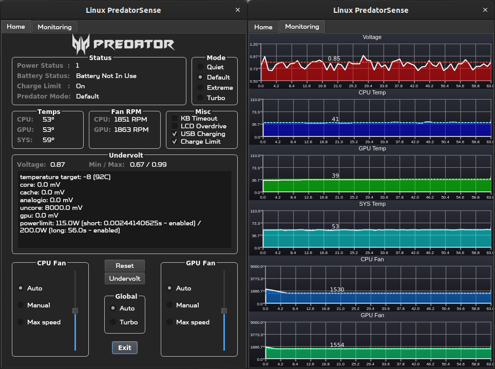

## PredatorSense™ clone for ```PH315-54-760S```
### Controls fan speed, gaming modes and undervolting on Linux. This application is intended for Acer Predator Helios 300 (2021) model.



## Disclaimer:
* Secure Boot **IS** \* supported if you only use the ```acpi_ec``` package.
* Secure Boot is **NOT** \* supported if you want to control CPU voltage offsets using the ```msr-tools``` and ```undervolt``` packages.
* Using this application with other laptops may potentially damage them. Proceed at your discretion.

## Install:
- From the command line
```
git clone https://github.com/snowyoneill/Linux-PredatorSense/
cd Linux-PredatorSense/
``` 

## Build (PyInstaller)

Dependencias Python:
```
pip install PyQt5 PyQtChart
```

Construir binario:
```
pyinstaller --clean --noconfirm main.spec
```

Instalar (root):
```
sudo ./configure.sh
```

## Usage:
### COMMAND LINE  
 - ```sudo``` is required in order to access the Super I/O EC registers and apply undervolt offsets.
  - From the command line run the main script as root:
  ```
  sudo python3 main.py
  ```

_[OPTIONAL]_
- Make sure to set the ```UNDERVOLT_PATH``` in ```main.py``` to the appropriate location of the undervolt package.
  - If you installed without sudo you can find where undervolt is located by doing.
    ```
    which undervolt
    ```
  - Next set ```COREOFFSET``` and ```CACHEOFFSET``` to the mV that you determined to be stable via throttlestop on windows.

### ICON
 - Alternatively you can copy the .desktop file to your applications folder and launch the program via it's icon.
  - Open ```predator-sense.desktop``` in a text editor.
  - Set ```<path_to_PredatorSense>``` to the directory where you downloaded this project.
  ```
  Exec=sh -c "pkexec env DISPLAY=$DISPLAY XAUTHORITY=$XAUTHORITY sh -c 'cd <path_to_PredatorSense> && python3 main.py'"
  Icon=<path_to_PredatorSense>/app_icon.ico
  ```
  - Copy the file to the application directory
  ```
  sudo cp predator-sense.desktop /usr/share/applications/
  ```
  - Now launch via the application and on initialization it will prompt for the user password.

### NVIDIA-POWERD
- After switching predator modes \* **YOU MAY NEED TO RESTART NVIDIA-POWERD SERVICE IN ORDER TO DETECT NEW TGP** \*
```
sudo systemctl restart nvidia-powerd
``` 
- You can check the current GPU TGP via
```
nvidia-smi
```

## Dependencies:
* Ubuntu / Linux Mint:
  ```
  sudo apt-get install python3-pyqt5, python3-pyqt5.qtchart
  ```

  ```
  git clone https://github.com/musikid/acpi_ec/
  cd acpi_ec
  sudo ./install.sh
  modprobe acpi_ec
  sudo cat /dev/ec #confirm access to EC
  ```

  ```
  [OPTIONAL]
  pip install git+https://github.com/georgewhewell/undervolt.git
  sudo apt-get install msr-tools
  ```
* Fedora:
  ```
  sudo dnf install python3-qt5
  sudo dnf install python3-pyqtchart
  ```
  Make sure SecureBoot is off.

  ```
  sudo dnf install dkms
  
  git clone https://github.com/musikid/acpi_ec/
  cd acpi_ec
  sudo ./install.sh
  modprobe acpi_ec
  sudo cat /dev/ec #confirm access to EC
  ```

  ```
  [OPTIONAL]
  pip install git+https://github.com/georgewhewell/undervolt.git
  sudo dnf install msr-tools
  ```

Packages:
* ```Python Qt5``` -> [PyQt5](https://pypi.org/project/PyQt5/)
* ```acpi_ec``` -> [acpi_ec by musikid](https://github.com/musikid/acpi_ec/)
* ```undervolt``` -> [Undervolt by georgewhewell](https://github.com/georgewhewell/undervolt)
* ```msr-tools``` -> [msr-tools by intel](https://github.com/intel/msr-tools)

## This is a fork of [PredatorSense by mohsunb](https://github.com/mohsunb/PredatorSense), customized for ```PH315-54```

## Changelog:

Mar 12, 2024

ecwrite_py
- If access to the EC cannot be obtained then the app will now shutdown.

frontend.py
- Bug fix, cast tick internal value to int.

main.py
- If an empty string is returned when querying the voltage, skip updating. Prevents crashes when msr-tools is not installed.

- Updated README to add more documentation on installation.

Mar 11, 2024

ecwrite.py
- Updated EC class to point to acpi_ec path ( /dev/ec ) instead of the default ( /sys/kernel/debug/ec/ec0/io ) which no longer is supported in Ubuntu.
- Optimized code to use a buffer to store the contents of the EC register. Load once and read multiple times per update cycle.
Added exception handling.

frontend.py
- Added a new monitoring tab to display the last 60 seconds of recorded voltage, temps and fan speed sensors.
- Created a new custom chart class for modularity.
- Increased the height of widget to accommodate new charts.

main.py
- Removed global min and max voltage readings.
- Changed the voltage reading to be an average of all the cores rather than core 0.
- Optmized voltage reading by reusing the same QProcess for each update rather than creating and destroying.
- Added voltage, undervolt and min and max class variables.
- Added missing batteryChargeLimit initialization.
- Created global UPDATE_INTERVAL variable to store update fequency in ms.
- Consolidated Qt frontend updates to the updatePredatorStatus function.
- Updated shutdown to cleanly free resources.

Sep 21, 2023
- Added user toggle for charge limiting.
- Bug fix output error for unknown CPU fan mode.

Dec 22
- Completely overhauled the UI.
  - Added new Dialogs for fan speed, temperatures, modes, undervolting and miscellaneous
  - Created a new screenshot to showcase the updated interface.
- Updated app icon to blue predator logo (originally red).
- Created a new class for accessing EC registers.
  - Close file handle on shutdown.
- Created a timer to periodically update the UI.
- Created toggle for LCD Overdrive.
- Created toggle for USB charging.
- New function to check the current VCORE voltage and record max/min.
- New functions to undervolt CPU.
- New function to query battery charge limit.
- New function to query predator mode.
- New function to read fan speed.
- Lots of refactoring.
